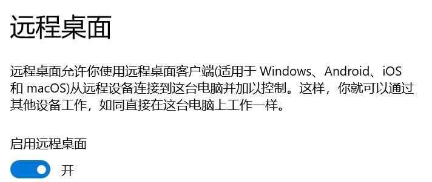
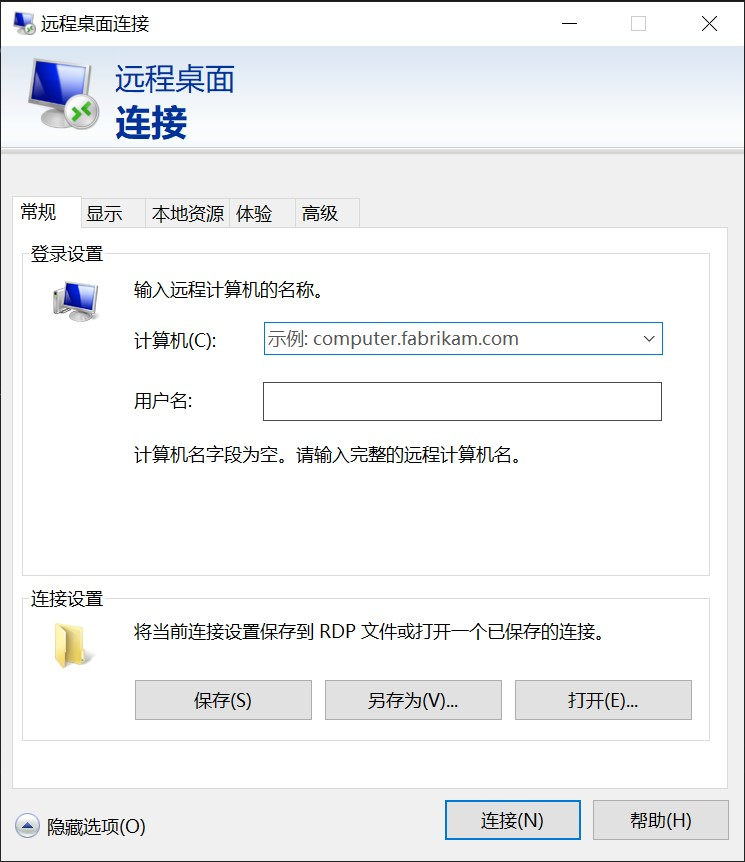

# 通过 frp 和服务器内网穿透远程连接到 win10+

frp 是一个开源的反向代理软件，通过它我们可以使处于内网或防火墙后的设备对外界提供服务，远程连接到 windows10 及以上版本的电脑就是一种简单好用的例子。

## 准备

1. VPS 一台（网速和连接性是主要的参考要素）
2. 你需要连接的 windows10+ 电脑一台（被连接），以下统称为“服务端”
3. 你手上的想连接上方电脑的设备，可以是 windows，Android，IOS，以下统称为“客户端”

## 安装

### 在 VPS 上安装 frp

1. 查看 frp 官网[releases](https://github.com/fatedier/frp/releases/)获得最新的版本
2. 下载最新的 frp

   `wget https://github.com/fatedier/frp/releases/download/v0.40.0/frp_0.40.0_linux_amd64.tar.gz`

3. 解压

   `tar -zxvf frp_0.40.0_linux_amd64.tar.gz`

4. 修改 frps.ini 内的配置文件

```ini
[common]
bind_port = 7000
dashboard_port = 7500
token = 12345678
dashboard_user = admin
dashboard_pwd = admin
```

::: warning
请自行设置 token、user 和 password
:::

- “bind_port”表示用于客户端和服务端连接的端口，这个端口号我们之后在配置客户端的时候要用到。
- “dashboard_port”是服务端仪表板的端口，若使用 7500 端口，在配置完成服务启动后可以通过浏览器访问 x.x.x.x:7500 （其中 x.x.x.x 为 VPS 的 IP）查看 frp 服务运行信息
- “token”是用于客户端和服务端连接的口令，请自行设置并记录，稍后会用到。
- “dashboard_user”和“dashboard_pwd”表示打开仪表板页面登录的用户名和密码，自行设置即可。

5. 运行

`./frps -c frps.ini`

此时访问 x.x.x.x:7500 并使用自己设置的用户名密码登录，即可看到仪表板界面。

6. 为面板配置 nginx 反代并绑定域名开启 https 加密提高安全性（可选）

安装 nginx，把域名 dns 解析到本 VPS

修改 nginx 配置`vim /etc/nginx/conf.d/frp.conf`

```nginx
server {
    listen  80;
    server_name 你的域名;
    location / {
        proxy_pass http://localhost:你的端口; # 端口为你第四步时设置的dashboard_port
        proxy_set_header Host $host;
        proxy_set_header X-Real-IP $remote_addr;
        proxy_set_header X-Forwarded-For $proxy_add_x_forwarded_for;
    }
}
```

通过 certbot 快速开启 https

`certbot --nginx`

此时访问你的域名即可看到仪表板界面。

### 在服务端上开启远程桌面并安装 frp

1. 开启远程桌面

访问开始->设置->系统->左边栏远程桌面->启用远程桌面



如果需要用其他用户访问则需配置下方用户。

2. 查看 frp 官网[releases](https://github.com/fatedier/frp/releases/)下载 win 版 frp 并解压

3. 修改 frpc.ini 内的配置文件

```ini
[common]
server_addr = VPS的IP地址
server_port = VPS端口
token = 12345678

[rdp]
type = tcp
local_ip = 127.0.0.1
local_port = 3389
remote_port = 7001
```

::: tip
common 部分为通用配置，rdp 部分是自定义规则，rdp 是 windows 远程桌面的缩写，你也可以自己起名
:::

关于通用配置：

- 在 common 内填入你上方设置在 VPS 上的配置
- 其中端口是 VPS 中的 bind_port

关于自定义规则：

- “[xxx]”表示一个规则名称，自己定义，便于查询即可。
- “type”表示转发的协议类型，有 TCP 和 UDP 等选项可以选择，如有需要请自行查询 frp 手册。
- “local_port”是本地应用的端口号，按照实际应用工作在本机的端口号填写即可。
- “remote_port”是该条规则在服务端开放的端口号，自己填写并记录即可。

4. 使用 bat 脚本后台启动 frp 并加入开机启动

编写 frpc.bat 如下：

```bat
@echo off
cd /d %~dp0
if "%1" == "h" goto begin
mshta vbscript:createobject("wscript.shell").run("""%~nx0"" h",0)(window.close)&&exit
:begin
REM
C:\frp\frpc -c C:\frp\frpc.ini
exit
```

## 使用（客户端连接到服务端）

### windows 客户端

1. 打开开始菜单->windows 附件->远程桌面连接



2. 连接

- 在计算机栏输入你之前配置的域名和端口，格式为[IP:端口]，没有配置域名则为 VPS 的 IP，端口为 frpc.ini 内配置的 remote_port，如未填写端口号则 windows 默认是 3389
- 在用户名栏输入你想要登录的用户

### Android 客户端

1. 下载 Remote Desktop，[google play 商店](https://play.google.com/store/apps/details?id=com.microsoft.rdc.androidx)

2. 右上角+号添加远程主机，输入你之前配置的域名和端口和你想要登录的用户

3. 点击配置好的主机即可连接到服务端

### IOS 客户端

1. 下载 Remote Desktop Mobile，[App Store](https://apps.apple.com/app/microsoft-remote-desktop/id714464092)

2. 右上角+号添加远程主机，输入你之前配置的域名和端口和你想要登录的用户

3. 点击配置好的主机即可连接到服务端
